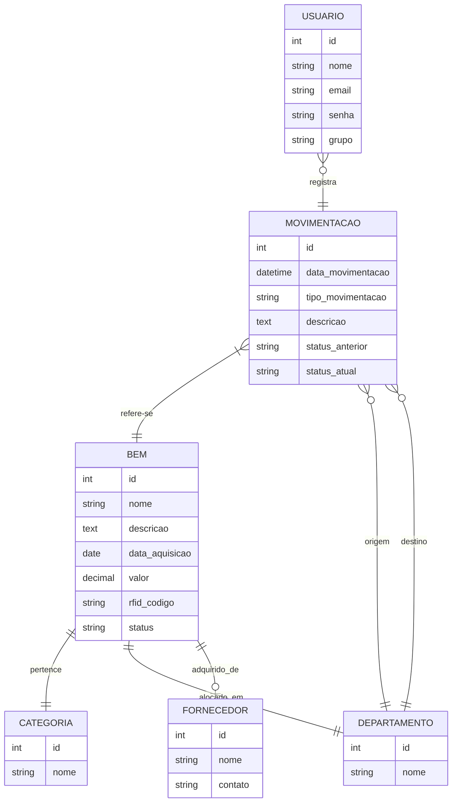

# 📊 Estrutura do Banco de Dados

Este documento descreve a estrutura do banco de dados do SIGPAT e os relacionamentos entre os modelos.

## 🔹 Diagrama Geral



## 🔹 Descrição dos Modelos

### 📌 Modelo `Bem`
O modelo **Bem** representa um item patrimonial gerenciado no sistema.

- **Campos principais**: Nome, descrição, data de aquisição, valor, código RFID, status.
- **Relacionamentos**:
  - Está vinculado a uma **Categoria**.
  - Pertence a um **Departamento**.
  - Pode ter um **Fornecedor** associado.

### 📌 Modelo `Categoria`
O modelo **Categoria** é utilizado para classificar os bens.

- **Campos principais**: Nome.

### 📌 Modelo `Departamento`
O modelo **Departamento** representa os setores da organização.

- **Campos principais**: Nome.

### 📌 Modelo `Fornecedor`
O modelo **Fornecedor** armazena informações sobre os fornecedores dos bens.

- **Campos principais**: Nome, contato.

### 📌 Modelo `Movimentacao`
O modelo **Movimentacao** registra qualquer movimentação realizada nos bens.

- **Campos principais**: Data da movimentação, tipo, descrição, status anterior e atual.
- **Relacionamentos**:
  - Relacionado a um **Bem** específico.
  - Pode envolver um **Departamento de Origem** e um **Departamento de Destino**.

### 📌 Modelo `Usuario`
O modelo **Usuario** gerencia os acessos e permissões dentro do sistema.

- **Campos principais**: Nome, e-mail, senha, grupo de acesso.
- **Relacionamentos**:
  - Um usuário pode registrar várias **Movimentações**.

## 🔹 Consultas e Operações Comuns

- **Listar todos os bens cadastrados**:
  ```python
  from bens.models import Bem
  bens = Bem.objects.all()
  ```

- **Buscar movimentações de um bem específico**:
  ```python
  from movimentacoes.models import Movimentacao
  movimentacoes = Movimentacao.objects.filter(bem_id=1)
  ```

- **Registrar uma nova movimentação**:
  ```python
  from movimentacoes.models import Movimentacao
  from bens.models import Bem
  from departamentos.models import Departamento

  bem = Bem.objects.get(id=1)
  departamento_origem = Departamento.objects.get(id=2)
  departamento_destino = Departamento.objects.get(id=3)

  nova_movimentacao = Movimentacao.objects.create(
      bem=bem,
      tipo_movimentacao="Transferência",
      descricao="Mudança de setor",
      departamento_origem=departamento_origem,
      departamento_destino=departamento_destino,
      status_anterior="Ativo",
      status_atual="Ativo"
  )
  ```