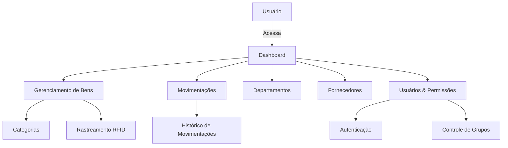

# 🏛️ SIGPAT - Sistema de Gestão de Patrimônio  

Bem-vindo à documentação oficial do **SIGPAT**, um sistema web para **gestão de patrimônio**, permitindo controle eficiente de bens, rastreamento, movimentações e administração de usuários.  

---

## 🚀 Visão Geral  

O **SIGPAT** é uma solução projetada para facilitar a gestão patrimonial de organizações, oferecendo funcionalidades como:  

✅ **Cadastro e categorização de bens**  
✅ **Rastreamento por código RFID**  
✅ **Movimentação de bens entre departamentos**  
✅ **Gestão de fornecedores e aquisições**  
✅ **Painel de controle com indicadores**  
✅ **Controle de permissões e usuários**  

---

## 📌 Estrutura do Sistema  

---

## 📖 Seções da Documentação  

📂 **[Módulos do Sistema](#)** – Estrutura e funcionamento dos aplicativos Django  
📂 **[Banco de Dados](#)** – Modelos e relacionamentos entre tabelas  
📂 **[API e Endpoints](#)** – Comunicação entre o frontend e backend  
📂 **[Autenticação e Permissões](#)** – Como funciona o controle de acesso  
📂 **[Guia de Desenvolvimento](#)** – Configuração do ambiente e contribuições  

Para explorar a documentação completa, utilize o menu lateral. 📚  

---

## 🛠️ Tecnologias Utilizadas  

O **SIGPAT** é desenvolvido com as seguintes tecnologias:  

- **🟢 Django** – Framework web para backend  
- **⚡ SQlite** – Banco de dados relacional  
- **📊 Chart.js** – Gráficos e visualizações  
- **💻 Bootstrap & SCSS** – Interface moderna e responsiva  
- **📄 MkDocs & Mermaid.js** – Documentação automatizada  

---