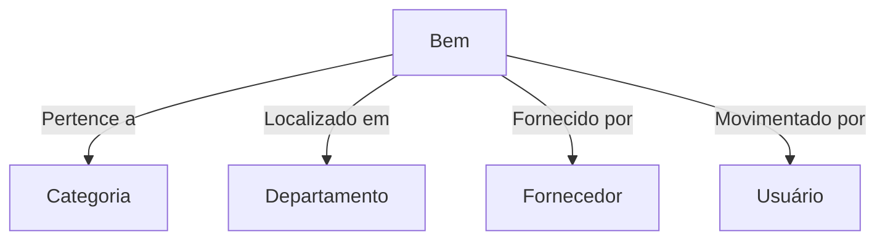

# Bem-vindo a Documentação SIGPAT

SIGPAT é um sistema para a gestão de patrimônio, desenvolvido com Django.

## 📌 Funcionalidades
- Cadastro e rastreamento de bens
- Gestão de categorias, departamentos e fornecedores
- Movimentação e histórico de ativos
- Dashboard com indicadores

## 📊 Exemplo de Diagrama Mermaid
